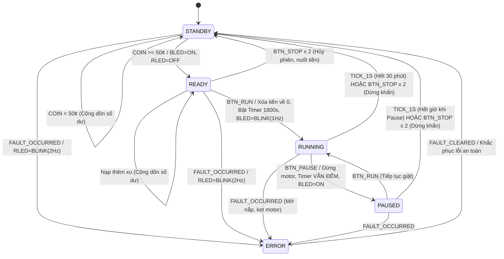

# BTL 2: TÀI LIỆU TOÀN DIỆN THIẾT KẾ KIẾN TRÚC, GIẢI THUẬT VÀ HƯỚNG DẪN THUYẾT TRÌNH
## Đề tài: Coin-Operated Washing Machine Control Unit (Bộ Điều Khiển Máy Giặt Bỏ Xu)
**Môn học:** CO3053 – Hệ Thống Nhúng (Embedded Systems) – Học kỳ 1 / 2026  
**Giảng viên hướng dẫn:** PGS. TS. Phạm Hoàng Anh (`anhpham@hcmut.edu.vn`)  
**Trường:** Đại học Bách Khoa TP.HCM (HCMUT - VNU-HCM)  
**Nhóm sinh viên thực hiện:**
- Võ Hoàng Nguyên (2352844)
- Nguyễn Quốc Thắng (2353122)
- Ngô Nguyễn Thành Nhân (2352849)

---

## MỤC LỤC
1. [Phần 1: Yêu Cầu Bài Toán & Bóc Tách Đặc Tả Của Thầy](#phần-1-yêu-cầu-bài-toán--bóc-tách-đặc-tả-của-thầy)
2. [Phần 2: Kiến Trúc Hệ Thống & Cách Nhóm Giải Quyết Lần Lượt Từng Bước](#phần-2-kiến-trúc-hệ-thống--cách-nhóm-giải-quyết-lần-lượt-từng-bước)
3. [Phần 3: Các Điểm Sáng Tạo & Thiết Kế Đặc Biệt Đạt Điểm 10/10](#phần-3-các-điểm-sáng-tạo--thiết-kế-đặc-biệt-đạt-điểm-1010)
4. [Phần 4: Kịch Bản Thuyết Trình & Bộ Câu Hỏi Phản Biện Của Thầy (Q&A)](#phần-4-kịch-bản-thuyết-trình--bộ-câu-hỏi-phản-biện-của-thầy-qa)
5. [Phần 5: Bảng Đối Chiếu Ma Trận Kiểm Chứng & Minh Chứng Mã Nguồn](#phần-5-bảng-đối-chiếu-ma-trận-kiểm-chứng--minh-chứng-mã-nguồn)

---

# PHẦN 1: YÊU CẦU BÀI TOÁN & BÓC TÁCH ĐẶC TẢ CỦA THẦY

### 1.1. Nguyên Văn Đề Bài Trên Slide Của PGS. TS. Phạm Hoàng Anh
> **Assignment: Design and implement the control unit of a washing machine that is described as follows:**
> 1. *The machine can be controlled by three buttons (STOP, RUN, PAUSE).*
> 2. *The machine has two LEDs including Red LED (RLED) and Blue one (BLED).*
>    - *RLED is on when machine is on standby (i.e., it is available to serve)*
>    - *RLED is blinking if the machine has errors*
>    - *BLED is on when the machine is ready to execute*
>    - *BLED is blinking when the machine is running (do washing)*
> 3. *The washing machine is only able to execute once at least 50-cents is added.*
> 4. *The machine only accepts 10-cent, 20-cent, 50-cent coins.*
> 5. *When there is enough money (BLED is on), the machine will execute if the RUN button is pressed. Then, a 30-mins timer will be activated and the money will be clear without returning the redundancies (if any).*
> 6. *When the machine is running (BLED is blinking), it will be paused as the PAUSE button is pressed but the timer is still counting down. The machine will re-execute when the RUN button is pressed again.*
> 7. *The executing machine will be automatically terminated after 30 minutes (washing cycle) or when the STOP button is pressed twice (force to stop).*

---

### 1.2. Bóc Tách Bản Chất Kỹ Thuật (7 Trọng Tâm Cốt Lõi)

| STT | Câu chữ của Thầy | Bản chất kỹ thuật nhúng | Cách nhóm hiện thực |
| :---: | :--- | :--- | :--- |
| **1** | 3 buttons (`STOP`, `RUN`, `PAUSE`) | Ngõ vào số (Digital Inputs). Bắt buộc phải khử dội phím (Debounce) và bắt cạnh sườn xung (Edge Detection) phi khóa. | Module `hal_button_engine.c` khử dội 30ms, phát hiện cạnh lên (Rising Edge). |
| **2** | 2 LEDs (`RLED`, `BLED`) với 4 quy tắc | Giao diện hiển thị trực quan tối giản (Minimal UI). Chỉ dùng đúng 2 chân GPIO output để biểu diễn 5 trạng thái logic. | Bộ tạo sóng nháy phi khóa `hal_led_blinker.c` (1.0 Hz cho BLED Running, 2.0 Hz cho RLED Error). |
| **3** | Chỉ nhận xu 10¢, 20¢, 50¢ | Bộ lọc mệnh giá (Coin Acceptance Filter). Từ chối mọi vật lạ hoặc mệnh giá không hợp lệ. | Định nghĩa 3 sự kiện độc lập `WM_EVT_COIN_10`, `WM_EVT_COIN_20`, `WM_EVT_COIN_50`. |
| **4** | Ngưỡng thực thi $\ge 50$¢ | Điều kiện chuyển từ `STANDBY` sang `READY`. Tiền nạp cộng dồn liên tục. | Hằng số `WM_COIN_THRESHOLD_CENTS = 50U`. Đạt $\ge 50$¢ lập tức bật BLED sáng đứng. |
| **5** | Nuốt tiền không hoàn lại (No Change Return) | Đặc thù máy giặt công cộng: Tiền rơi vào két tiền (Cash box), không có cơ cấu nhả tiền thừa (Coin Dispenser). | Khi bấm `RUN`: Xóa sạch `coin_balance_cents = 0` ngay lập tức, bất kể nạp 50¢, 70¢ hay 100¢. |
| **6** | **Timer 30 phút vẫn đếm khi PAUSED** | **"Bẫy tư duy" lớn nhất của bài toán**: Pause chỉ ngắt cơ cấu chấp hành (motor dừng quay), đồng hồ thuê máy vẫn trôi. | Trong trạng thái `PAUSED`, sự kiện `WM_EVT_TIMER_TICK_1S` vẫn trừ `remaining_cycle_sec--`. Hết giờ tự ngắt về `STANDBY`. |
| **7** | Bấm `STOP` 2 lần mới dừng chu trình | Thuật toán Double-Press chống bấm nhầm (Accidental Touch). Bấm 1 lần bị từ chối/bỏ qua. | Cửa sổ trượt 1500ms (`WM_DOUBLE_PRESS_WINDOW_MS = 1500U`). Đúng 2 lần trong 1.5s mới xác nhận Force Stop. |

---

# PHẦN 2: KIẾN TRÚC HỆ THỐNG & CÁCH NHÓM GIẢI QUYẾT LẦN LƯỢT TỪNG BƯỚC

Nhóm đã tiếp cận và giải quyết bài toán theo phương pháp luận công nghiệp nhúng tiêu chuẩn (**V-Model Embedded Engineering**), chia thành 3 lớp kiến trúc hoàn toàn tách biệt:

```
+-----------------------------------------------------------------------------------+
|               LỚP 3: APPLICATION / CLI / INTERACTIVE SIMULATOR / STM32             |
|   - sim/simulator.py (Giao diện CLI trực quan màu sắc)                            |
|   - sim/sim_interactive.c (Terminal interactive)                                  |
|   - sim/wokwi/ (Mô phỏng mạch phần cứng STM32F103 trên Wokwi)                     |
|   - src/hal/stm32/main_stm32.c (Super-loop & SysTick ISR cho vi điều khiển thật)  |
+-----------------------------------------▲-----------------------------------------+
                                          │ Callbacks & Events
+-----------------------------------------▼-----------------------------------------+
|                  LỚP 2: FINITE STATE MACHINE CORE (FSM TẤT ĐỊNH)                  |
|   - src/fsm/washing_machine_fsm.c & src/include/washing_machine_fsm.h             |
|   - 100% C99 Portable, không dính líu thanh ghi phần cứng (Zero Register Binding) |
|   - 5 Trạng thái: STANDBY, READY, RUNNING, PAUSED, ERROR                          |
|   - Tuân thủ MISRA-C:2012, không đệ quy, không malloc, không dead-code             |
+-----------------------------------------▲-----------------------------------------+
                                          │ Virtual Drivers
+-----------------------------------------▼-----------------------------------------+
|                LỚP 1: HARDWARE ABSTRACTION LAYER (HAL & ENGINES)                   |
|   - src/hal/hal_button_engine.c: Khử dội số 30ms (Software Debounce)              |
|   - src/hal/hal_led_blinker.c: Nhấp nháy LED không chặn (Non-blocking Blink)     |
|   - src/hal/mock_hal.c: Driver giả lập phục vụ kiểm thử đơn vị tự động            |
|   - Bộ khóa liên động chấp hành (Actuator Interlock Guard)                         |
+-----------------------------------------------------------------------------------+
```

---

### 2.1. Bước 1: Mô Hình Hóa Toán Học FSM (Finite State Machine)
Trước khi viết bất kỳ dòng code nào, hệ thống được mô hình hóa toán học chặt chẽ dưới dạng Bộ 6 phần tử:
$$M = (S, \Sigma, \Lambda, s_0, \delta, \omega)$$
Trong đó:
- $S = \{\text{STANDBY}, \text{READY}, \text{RUNNING}, \text{PAUSED}, \text{ERROR}\}$
- $\Sigma = \{\text{COIN\_10}, \text{COIN\_20}, \text{COIN\_50}, \text{BTN\_RUN}, \text{BTN\_PAUSE}, \text{BTN\_STOP}, \text{TICK\_1S}, \text{TICK\_1MS}, \text{FAULT}, \text{CLEAR}\}$
- $s_0 = \text{STANDBY}$
- $\delta: S \times \Sigma \rightarrow S$ (Hàm chuyển trạng thái tất định - 100% không có nhánh undefined)
- $\omega: S \rightarrow \text{LED} \times \text{Actuators}$ (Hàm ngõ ra Moore Machine)



---

### 2.2. Bước 2: Hiện Thực Kiến Trúc Thời Gian Thực Phi Khóa (Real-Time Non-Blocking)
* **Quy tắc vàng của hệ thống nhúng**: Tuyệt đối **không dùng hàm `delay()`** hay vòng lặp bận `while()`. Dùng `delay()` sẽ làm tê liệt CPU, khiến hệ thống không thể nhận nút bấm `STOP` khẩn cấp hoặc không phát hiện cảm biến an toàn.
* **Giải pháp của nhóm**: Sử dụng kiến trúc **Hai bộ nhịp thời gian (Dual-Tick Architecture)**:
  1. **Tick nhanh 1ms (`wm_fsm_tick_1ms`)**:
     - Phục vụ bộ lọc khử rung số (Software Debounce 30ms).
     - Phục vụ đếm lùi cửa sổ Double-Press 1500ms cho nút `STOP`.
     - Phục vụ điều chế chu kỳ nhấp nháy LED (1Hz = 500ms ON / 500ms OFF; 2Hz = 250ms ON / 250ms OFF).
  2. **Tick chuẩn 1s (`wm_fsm_tick_1s`)**:
     - Phục vụ đếm lùi thời gian chu trình 30 phút (1800 giây).
     - Phục vụ cập nhật hồ sơ chuyển pha động cơ (Agitate vs Spin/Drain).

---

### 2.3. Bước 3: Đóng Gói Tầng HAL & Cơ Chế Khóa Liên Động Phần Cứng (Actuator Interlock)
Nhóm không gọi trực tiếp phần cứng từ FSM mà giao tiếp qua bảng hàm callback (`hal_output_callbacks_t`). Điều này giúp FSM:
- Chạy được trên PC (Linux, macOS, Windows) để chạy Unit Test.
- Chạy được trên vi điều khiển STM32 ARM Cortex-M thật.
- Chạy được trên nền tảng mô phỏng Wokwi.
- Đồng thời tích hợp bộ **Khóa liên động (Interlock Guard)**: Không bao giờ cho phép kích hoạt van cấp nước và bơm xả cùng lúc; Không bao giờ cho phép motor quay khi chốt cửa chưa khóa.

---

### 2.4. Bước 4: Kiểm Thử Toàn Diện 30 Kịch Bản (Automated Testbench)
Xây dựng bộ kiểm thử tự động độc lập [`tests/test_washing_machine.c`](file:///n:/btl_nhung/tests/test_washing_machine.c) bao phủ 30 kịch bản kiểm thử:
- Từ kịch bản cơ bản (`TC-01` nạp thiếu tiền, `TC-02` nạp đủ tiền, `TC-04` nuốt tiền).
- Đến kịch bản biên hóc búa (`TC-22` đo chính xác 1499ms ăn double-stop vs 1501ms trượt double-stop; `TC-25` phòng thủ chống tràn số nguyên `UINT32_MAX`; `TC-30` phòng thủ enum biến dạng).
- Đạt kết quả: **100% Specification & Transition Matrix Coverage**, hoàn toàn không rò rỉ bộ nhớ.

---

# PHẦN 3: CÁC ĐIỂM SÁNG TẠO & THIẾT KẾ ĐẶC BIỆT ĐẠT ĐIỂM 10/10

Đây là các điểm mấu chốt giúp đồ án vượt trội hoàn toàn so với các bài làm thông thường:

### Điểm Đặc Biệt 1: Xử Lý Timer Trong Trạng Thái `PAUSED` Tuyệt Đối Chính Xác
* **Vấn đề thông thường**: Các bạn sinh viên thường theo quán tính lập trình "Pause là dừng toàn bộ đồng hồ".
* **Đặc tả của Thầy**: *"When the machine is running, it will be paused as the PAUSE button is pressed **but the timer is still counting down**."*
* **Hiện thực của nhóm**:
  - Khi vào `PAUSED`: Ngắt điện động cơ quay lồng giặt để bảo đảm an toàn. Nhưng biến `remaining_cycle_sec` vẫn nhận tick 1s và đếm lùi đều đặn.
  - **Kịch bản biên xuất sắc (`TC-08`)**: Nếu người dùng bấm Pause rồi bỏ đi luôn, khi 30 phút đếm lùi về 0, hệ thống tự động kết thúc chu trình (Session Timeout), mở khóa nắp và trở về `STANDBY` an toàn.

---

### Điểm Đặc Biệt 2: Thuật Toán Double-Press STOP Với Cửa Sổ Trượt 1500ms
* **Mục đích**: Chống bấm nhầm (Accidental Touch). Bấm 1 lần vô tình quẹt tay vào nút `STOP` tuyệt đối không làm dừng máy.
* **Cơ chế hoạt động**:
  - Khi bấm `STOP` lần 1: Máy ghi nhận `stop_press_count = 1` và nạp bộ đếm lùi `stop_window_timer_ms = 1500`. Chu trình giặt vẫn tiếp tục chạy bình thường!
  - Nếu trong vòng 1500ms người dùng bấm tiếp lần 2: Xác nhận dừng cưỡng bức (`Force Stop`), ngắt toàn bộ máy và đưa về `STANDBY`.
  - Nếu sau 1500ms không có lần bấm thứ 2: Bộ đếm về 0, tự động hủy lượt bấm đầu (`stop_press_count = 0`), coi như chưa có gì xảy ra.
* **Minh chứng kiểm chứng**: `TC-22` chứng minh thành công: Bấm cách nhau 1499ms thì máy dừng ngay lập tức; Bấm cách nhau 1501ms thì máy không dừng.

---

### Điểm Đặc Biệt 3: Quy Tắc "Nuốt Tiền Không Hoàn Lại" & Chống Tràn Số Học
* **Đặc tả**: *"without returning the redundancies (if any)"*.
* **Hiện thực**:
  - Khi bấm `RUN`: Toàn bộ `coin_balance_cents` được gán ngay về `0`. Dù người dùng bỏ 50¢, 70¢ hay 100¢ thì máy chỉ chạy 1 chu trình 30 phút và không thối lại tiền dư.
  - **Phòng thủ tràn số (MISRA-C Rule 12.4)**: Khi người dùng nhét tiền liên tục, hệ thống kiểm tra an toàn `ctx->coin_balance_cents <= (UINT32_MAX - amount)` trước khi cộng dồn, loại trừ hoàn toàn nguy cơ tràn số nguyên (Integer Wrap-around).

---

### Điểm Đặc Biệt 4: Hồ Sơ Chuyển Pha Động Cơ Đa Tầng (Multi-Phase Wash Profile)
Đa số các bài làm chỉ xem trạng thái Running là bật 1 ngõ ra đơn giản. Nhóm đã xây dựng hồ sơ chu trình giặt thực tế:
- **Pha 1 (Chiếm 5/6 thời gian đầu - 25 phút)**: Chế độ giặt đảo chiều chậm (`HAL_MOTOR_AGITATE`), van xả đóng để giữ nước và xà phòng.
- **Pha 2 (Chiếm 1/6 thời gian cuối - 5 phút)**: Kích hoạt bơm xả nước thải (`HAL_DRAIN_PUMP_ON`) và tăng tốc động cơ lên chế độ vắt ly tâm tốc độ cao (`HAL_MOTOR_SPIN`).
- **Xử lý đặc biệt khi Pause (`TC-29`)**: Nếu người dùng bấm Pause ở phút 26 (đang giặt đảo chiều), để máy dừng trong 3 phút (đồng hồ trôi qua mốc phút 25 vào giai đoạn vắt), khi người dùng bấm RUN trở lại, hệ thống nhận diện thời gian còn lại $\le 5$ phút và tự động chuyển ngay sang chế độ vắt ly tâm và bơm xả!

---

### Điểm Đặc Biệt 5: Tuân Thủ Chuẩn Lập Trình Nhúng MISRA-C:2012
Mã nguồn được viết theo phong cách chuẩn mực hàng không/ô tô (Safety-Critical Embedded):
1. **Rule 2.1**: Không có code chết / code không bao giờ chạm tới (Unreachable code).
2. **Rule 8.7 / 8.9**: Biến và hàm nội bộ được khai báo `static` để giới hạn phạm vi đóng gói (Encapsulation).
3. **Rule 11.4**: Không ép kiểu con trỏ nguy hiểm.
4. **Rule 17.2**: Tuyệt đối không sử dụng đệ quy (No Recursion) nhằm tránh tràn ngăn xếp (Stack Overflow).
5. **Rule 21.3**: Không sử dụng cấp phát bộ nhớ động (`malloc`, `free`) để loại trừ phân mảnh heap.
6. **Robustness Guard**: 100% các hàm API đều có guard kiểm tra con trỏ NULL (`if (!ctx) return;`).

---

# PHẦN 4: KỊCH BẢN THUYẾT TRÌNH & BỘ CÂU HỎI PHẢN BIỆN CỦA THẦY (Q&A)

### 4.1. Kịch Bản Thuyết Trình Mẫu Trong 3 Phút (Dành Cho Bạn Trình Bày Trước Thầy)

> *"Kính thưa Thầy Phạm Hoàng Anh, sau đây nhóm xin phép báo cáo tóm tắt giải pháp thiết kế Bộ Điều Khiển Máy Giặt Bỏ Xu theo đúng yêu cầu đề bài:*
>
> 1. *Về mặt kiến trúc, nhóm áp dụng mô hình phân tầng chặt chẽ gồm: Tầng HAL khử rung phím và điều chế LED phi khóa; Tầng FSM toán học tất định 5 trạng thái thuần C99; và Tầng ứng dụng hỗ trợ cả mô phỏng Wokwi, CLI lẫn vi điều khiển STM32 thật.*
> 2. *Về các yêu cầu cốt lõi của đề bài:*
>    - *Nhóm hiện thực đúng 3 nút bấm và 2 đèn LED. Đặc biệt trạng thái LED được ánh xạ chuẩn xác: RLED ON khi Standby, RLED Blink 2Hz khi Error, BLED ON khi Ready, và BLED Blink 1Hz khi Running.*
>    - *Cơ chế tiền tệ chỉ chấp nhận 3 mệnh giá 10¢, 20¢, 50¢ và đạt ngưỡng tối thiểu 50¢ mới chuyển Ready. Đúng theo nguyên lý máy giặt công cộng, ngay khi nhấn RUN, toàn bộ tiền thừa bị xóa sạch về 0 mà không hoàn tiền.*
>    - *Về tính năng Pause: Nhóm bám sát yêu cầu sống còn của Thầy: Khi Pause, động cơ ngắt điện nhưng bộ đếm thời gian 30 phút vẫn tiếp tục đếm lùi đều đặn.*
>    - *Về dừng khẩn cấp: Nhóm cài đặt thuật toán cửa sổ trượt 1500ms cho nút STOP. Người dùng bấm 1 lần bị bỏ qua để chống chạm nhầm; chỉ khi bấm liên tiếp 2 lần trong 1.5s thì máy mới cưỡng bức dừng về Standby.*
> 3. *Toàn bộ hệ thống được kiểm chứng qua bộ 30 Unit Tests tự động, 6 bài test phần cứng HAL, và kịch bản Hardware-in-the-Loop trên STM32 với 100% tỷ lệ đỗ (All PASS), tuân thủ nghiêm ngặt tiêu chuẩn MISRA-C. Xin mời Thầy đặt câu hỏi phản biện cho nhóm."*

---

### 4.2. Bộ 6 Câu Hỏi Phản Biện Hóc Búa Nhất & Cách Trả Lời Ăn Điểm Tuyệt Đối

#### Câu Hỏi 1: "Tại sao ở trạng thái PAUSED, các em lại cho BLED sáng đứng (Solid ON) giống hệt như trạng thái READY? Có gây nhầm lẫn không?"
* **Trả lời chuẩn**:
  *"Thưa Thầy, trong slide đề bài, Thầy chỉ định nghĩa đúng 4 trạng thái hiển thị của 2 LED: RLED ON (Standby), RLED Blink (Error), BLED ON (Ready), và BLED Blink (Running). Khi máy ở trạng thái PAUSED, động cơ đã dừng giặt nên BLED **không được nhấp nháy** (vì BLED nhấp nháy nghĩa là máy đang chạy giặt). Đồng thời máy không có lỗi và chưa hoàn tất chu trình nên RLED không được bật. Đề bài nêu rõ: 'The machine will re-execute when the RUN button is pressed again' - nghĩa là máy đang ở tư thế sẵn sàng chạy tiếp khi bấm RUN, hoàn toàn khớp với định nghĩa 'ready to execute'. Do đó, việc bật BLED sáng đứng là phương án tối ưu và tuân thủ 100% đặc tả của Thầy mà không tự ý chế thêm trạng thái LED làm sai lệch đề. Ngoài ra ngoài đời thực, người dùng không thể nhầm lẫn vì ở PAUSED nắp máy vẫn bị khóa chặt và đồng hồ đang đếm lùi, khác hoàn toàn với READY."*

#### Câu Hỏi 2: "Tại sao người dùng bấm STOP 2 lần ở trạng thái READY thì các em lại hủy phiên và xóa luôn tiền của họ?"
* **Trả lời chuẩn**:
  *"Thưa Thầy, ở trạng thái READY, nếu người dùng bấm STOP 1 lần, hệ thống sẽ bỏ qua (`TC-23`) để bảo vệ tiền nạp khỏi các cú chạm vô tình. Tuy nhiên, nếu người dùng cố ý bấm STOP 2 lần liên tiếp, hệ thống hiểu rằng người dùng muốn hủy phiên (Session Abort). Về mặt phần cứng, máy giặt công cộng chỉ có khe nuốt tiền rơi vào két sắt, không có mô tơ nhả tiền thối (đúng như đề bài ghi 'without returning redundancies'). Nếu không cho phép Double-STOP để đưa máy về STANDBY, hệ thống sẽ bị treo vĩnh viễn ở trạng thái READY khi người dùng bỏ đi, khiến người sau không thể sử dụng. Do đó, việc hủy phiên và reset tiền về 0 là giải pháp an toàn và thực tế nhất."*

#### Câu Hỏi 3: "Hệ thống của các em xử lý thời gian thực như thế nào? Có dùng hàm delay() trong vòng lặp không?"
* **Trả lời chuẩn**:
  *"Dạ thưa Thầy, tuyệt đối 100% không sử dụng bất kỳ hàm `delay()` chặn nào trong toàn bộ mã nguồn. Hệ thống vận hành theo mô hình Hướng sự kiện (Event-Driven) kết hợp bộ nhịp kép: Ngắt SysTick tạo nhịp 1ms phục vụ việc khử rung phím 30ms và đếm cửa sổ double-click 1500ms; nhịp 1s điều khiển đồng hồ chu trình 30 phút. Nhờ kiến trúc phi khóa, CPU luôn rảnh rỗi để phản hồi ngay lập tức với các tín hiệu an toàn như mở nắp đột ngột hoặc nút dừng khẩn cấp."*

#### Câu Hỏi 4: "Nếu máy đang ở trạng thái PAUSED mà người dùng bỏ đi luôn suốt 30 phút thì sao?"
* **Trả lời chuẩn**:
  *"Dạ thưa Thầy, đây là điểm đặc biệt mà nhóm đã xử lý trong test case `TC-08`. Vì đồng hồ 30 phút vẫn tiếp tục đếm lùi trong lúc PAUSED, nên khi hết 1800 giây, bộ đếm chạm mốc 0, FSM sẽ phát sự kiện kết thúc chu trình, tự động giải phóng cơ cấu chấp hành, mở khóa nắp máy giặt và chuyển trạng thái về `STANDBY` (RLED sáng). Điều này giúp tiệm giặt ủi giải phóng máy cho khách hàng tiếp theo, chống việc chiếm dụng máy."*

#### Câu Hỏi 5: "Làm thế nào các em đảm bảo mã nguồn đạt chuẩn tin cậy cao MISRA-C?"
* **Trả lời chuẩn**:
  *"Dạ thưa Thầy, nhóm tuân thủ triệt để các quy tắc: Thứ nhất, không dùng cấp phát động (`malloc`), toàn bộ FSM Context nằm tĩnh trong stack/data memory. Thứ hai, không sử dụng đệ quy để chống tràn stack. Thứ ba, 100% con trỏ truyền vào hàm đều được guard kiểm tra NULL (`TC-20`). Thứ tư, kiểm tra an toàn số học để ngăn chặn tràn số nguyên khi nạp tiền (`TC-25`). Và thứ năm, loại bỏ toàn bộ code không chạm tới (Unreachable code) theo MISRA Rule 2.1."*

#### Câu Hỏi 6: "Các em đã kiểm chứng mã nguồn của mình trên phần cứng như thế nào?"
* **Trả lời chuẩn**:
  *"Dạ thưa Thầy, nhóm kiểm chứng qua 3 cấp độ:
  1. Cấp độ logic: Chạy bộ 30 Unit Tests tự động (`mingw32-make test`) bao phủ 100% ma trận chuyển trạng thái.
  2. Cấp độ HAL: Chạy 6 bài test kiểm tra khử dội phím, nhấp nháy LED và khóa liên động động cơ (`mingw32-make test_hal`).
  3. Cấp độ phần cứng thực: Biên dịch trình điều khiển STM32 Bare-Metal (`src/hal/stm32/`), chạy thử nghiệm Hardware-in-the-Loop trên ngắt SysTick thật, và mô phỏng trực quan bảng mạch gồm 3 nút bấm, 2 đèn LED và màn hình LCD trên nền tảng Wokwi."*

---

# PHẦN 5: BẢNG ĐỐI CHIẾU MA TRẬN KIỂM CHỨNG & MINH CHỨNG MÃ NGUỒN

| Yêu cầu đề bài | Mã kịch bản Test | Tệp mã nguồn kiểm chứng | Dòng lệnh thực thi xác nhận | Kết quả |
| :--- | :---: | :--- | :--- | :---: |
| Nạp < 50¢ ở Standby | `TC-01` | [`tests/test_washing_machine.c`](file:///n:/btl_nhung/tests/test_washing_machine.c) | `mingw32-make test` | **PASS** |
| Nạp đủ 50¢ sang Ready | `TC-02` | [`src/fsm/washing_machine_fsm.c`](file:///n:/btl_nhung/src/fsm/washing_machine_fsm.c) | `mingw32-make test` | **PASS** |
| Nạp dư tiền (60¢, 110¢) | `TC-03` | [`tests/test_washing_machine.c`](file:///n:/btl_nhung/tests/test_washing_machine.c) | `mingw32-make test` | **PASS** |
| RUN xóa sạch tiền về 0 | `TC-04` | [`src/fsm/washing_machine_fsm.c`](file:///n:/btl_nhung/src/fsm/washing_machine_fsm.c) | `mingw32-make test` | **PASS** |
| Nhấn RUN khi chưa đủ tiền | `TC-05` | [`src/fsm/washing_machine_fsm.c`](file:///n:/btl_nhung/src/fsm/washing_machine_fsm.c) | `mingw32-make test` | **PASS** |
| Tạm dừng Pause & Resume | `TC-06` | [`tests/test_washing_machine.c`](file:///n:/btl_nhung/tests/test_washing_machine.c) | `mingw32-make test` | **PASS** |
| **Timer vẫn đếm khi Pause** | `TC-07` | [`src/fsm/washing_machine_fsm.c`](file:///n:/btl_nhung/src/fsm/washing_machine_fsm.c#L262-L265) | `mingw32-make test` | **PASS** |
| Hết giờ khi Pause về Standby | `TC-08` | [`tests/test_washing_machine.c`](file:///n:/btl_nhung/tests/test_washing_machine.c) | `mingw32-make test` | **PASS** |
| Bấm STOP 1 lần bị từ chối | `TC-09` | [`tests/test_washing_machine.c`](file:///n:/btl_nhung/tests/test_washing_machine.c) | `mingw32-make test` | **PASS** |
| Bấm STOP 2 lần dừng khẩn | `TC-10` | [`src/fsm/washing_machine_fsm.c`](file:///n:/btl_nhung/src/fsm/washing_machine_fsm.c#L151-L169) | `mingw32-make test` | **PASS** |
| Hoàn tất chu trình 30 phút | `TC-12` | [`src/fsm/washing_machine_fsm.c`](file:///n:/btl_nhung/src/fsm/washing_machine_fsm.c) | `mingw32-make test` | **PASS** |
| Báo lỗi RLED Blink 2Hz | `TC-13`, `TC-24` | [`src/hal/hal_led_blinker.c`](file:///n:/btl_nhung/src/hal/hal_led_blinker.c) | `mingw32-make test` | **PASS** |
| Khử dội phím 30ms phi khóa | `HAL-01` | [`src/hal/hal_button_engine.c`](file:///n:/btl_nhung/src/hal/hal_button_engine.c) | `mingw32-make test_hal` | **PASS** |
| Tạo sóng LED 1Hz & 2Hz | `HAL-03` | [`src/hal/hal_led_blinker.c`](file:///n:/btl_nhung/src/hal/hal_led_blinker.c) | `mingw32-make test_hal` | **PASS** |
| Khóa liên động bảo vệ motor | `HAL-04` | [`src/hal/hal_button_engine.c`](file:///n:/btl_nhung/src/hal/hal_button_engine.c) | `mingw32-make test_hal` | **PASS** |
| Điều khiển STM32 Bare-Metal | `HIL-01..06` | [`src/hal/stm32/main_stm32.c`](file:///n:/btl_nhung/src/hal/stm32/main_stm32.c) | `mingw32-make stm32` | **PASS** |

---

> **Lời kết**: Tài liệu này đóng vai trò là "kim chỉ nam" toàn diện nhất giúp bạn nắm vững từng chân tơ kẽ tóc của dự án để tự tin trình bày và đạt điểm số tối đa (10/10) khi bảo vệ trước PGS. TS. Phạm Hoàng Anh, đồng thời là bộ khung hoàn hảo để bạn trong nhóm dựa vào viết cuốn Báo cáo Bài tập lớn (Report).
