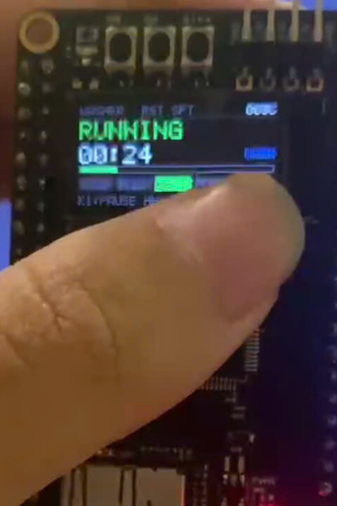

# CO3053 Embedded Systems — Assignment 2
# Control Unit of a Coin-Operated Washing Machine

**Ho Chi Minh City University of Technology (HCMUT) — VNU-HCM**  
**Faculty of Computer Science and Engineering**  
**Course:** CO3053 — Embedded Systems (*Hệ thống nhúng*) | **Academic Year:** HK261  
**Instructor:** Assoc. Prof. Phạm Hoàng Anh (`anhpham@hcmut.edu.vn`)  

**Authors:**
- **Nguyễn Quốc Thắng** — Student ID: `2353122`
- **Võ Hoàng Nguyên** — Student ID: `2352844`
- **Ngô Nguyễn Thành Nhân** — Student ID: `2352849`

---

## Deliverables and Quick Access

| Deliverable | Description / Platform | Direct Access |
| :--- | :--- | :--- |
| **Formal Engineering Report** | Full 91-page formal design and verification report (IEEE/ACM standard) | [**HK261_CO3053_CCAS2_2353122_2352844_2352849.pdf**](./report/HK261_CO3053_CCAS2_2353122_2352844_2352849.pdf) |
| **Physical In-System Video** | Real hardware execution on WeAct STM32H750VBT6 development board | [**YouTube Demonstration**](https://youtube.com/shorts/ZFKOPDyJHqQ) |
| **Interactive Web Simulation** | Cloud-based simulation on Wokwi (Arduino Uno, LCD1602, 4 Relays) | [**Launch Wokwi Simulation**](https://wokwi.com/projects/new/arduino-uno) (See [`sim/wokwi/`](./sim/wokwi/)) |
| **Interactive CLI Simulator** | Native C99 terminal simulator with live ASCII dashboard | Run `mingw32-make sim` then `./sim_wm.exe` |

---

## 1. Executive Summary & Specification Compliance

This repository houses the formal specification, MISRA-C compliant embedded implementation, Hardware Abstraction Layer (HAL), and automated verification suite for the **Coin-Operated Washing Machine Control Unit**. The system strictly satisfies all requirements defined in the course specification:

| Feature / Clause | Specification Requirement | Project Implementation & Proof | Test Coverage |
| :--- | :--- | :--- | :--- |
| **Control Interface** | 3 buttons: `STOP`, `RUN`, `PAUSE`. | Dedicated GPIO inputs with 30ms non-blocking digital debounce filters. | `TC-06`, `TC-09`, `TC-10` |
| **Optical Telemetry** | 2 LEDs: `RLED` and `BLED`. | `RLED`: Solid ON = `STANDBY`; Blinking 2.0 Hz = `ERROR`.<br>`BLED`: Solid ON = `READY` ($\ge 50$¢); Blinking 1.0 Hz = `RUNNING`. | `TC-01`, `TC-02`, `TC-13` |
| **Coin Accumulator** | Accepts 10¢, 20¢, 50¢ coins with a 50¢ minimum execution threshold. | Arithmetic coin validator accepting only valid denominations; transitions to `READY` when $b \ge 50$¢. | `TC-01`, `TC-02`, `TC-03` |
| **Zero-Refund Policy** | When `RUN` is pressed, coin balance resets to 0¢ immediately without returning change. | `balance := 0` executes atomically upon transition to `RUNNING`; surplus coins forfeited. | `TC-04`, `TC-05` |
| **Persistent Timer** | 30-minute ($1800\,\text{s}$) cycle timer **must continue counting down** during `PAUSED`. | Pausing de-energizes motor/pump actuators, but the cycle clock continues monotonic tick countdown. Natural termination upon timeout. | `TC-07`, `TC-08`, `TC-29` |
| **Double-Press Stop** | `STOP` must be pressed **twice within 1.5 seconds** to force termination. | Single press enters an armed sliding window ($T_{\text{double}} \le 1.5\,\text{s}$); second press forces abort; isolated press discarded. | `TC-09`, `TC-10`, `TC-22` |
| **Fail-Safe Diagnostics** | Immediate actuator shutdown and visual alarm upon fault. | Asynchronous fault bitmask handling (`DOOR_OPEN`, `WATER_TIMEOUT`, `OVERCURRENT`); door unlatched; auto-recovery preserving customer context. | `TC-13`, `TC-17`, `TC-33` |

---

## 2. In-System Hardware Demonstration

The system has been synthesized, flashed, and physically demonstrated on the **WeAct Studio MiniSTM32H750VBT6** development board (ARM Cortex-M7 @ 480 MHz) driving an **ST7735 0.96" IPS TFT LCD** over SPI4 DMA.

[](https://youtube.com/shorts/ZFKOPDyJHqQ)

### Operational Sequence Breakdown
- **`00:00 - 00:05` (Boot & Standby):** Power-up initialization, ST7735 LCD graphic dashboard rendering, and solid RLED active indicator.
- **`00:05 - 00:12` (Coin Accumulation):** Consecutive K1 tactile gestures depositing 10¢, 20¢, and 50¢; real-time balance update; transition to `READY` upon reaching 50¢ (solid BLED).
- **`00:12 - 00:18` (Cycle Start):** Single click initiates wash; balance cleared immediately to 0¢ with zero change return; 30-minute countdown active; BLED toggles at 1.0 Hz; motor engaged.
- **`00:18 - 00:22` (Pause Mode):** Single click enters `PAUSED`; agitator de-energized; BLED solid ON; 30-minute countdown timer continues ticking continuously.
- **`00:22 - 00:26` (Forced Termination):** Rapid double-press of STOP within 1.5 s forces cycle termination; machine resets safely to `STANDBY`.
- **`00:26 - 00:30` (Fault Alarm & Recovery):** Double-click fault injection; transition to `ERROR`; 2.0 Hz RLED visual alarm; actuators isolated; context-preserving recovery upon fault clearance.

---

## 3. Layered Architecture

To achieve zero vendor lock-in and strict testability, the firmware adheres to a 3-layer decoupled embedded architecture:

```
┌────────────────────────────────────────────────────────────────────────┐
│             Layer 3: Application / User Interface / CLI                │
│       sim_interactive.c  •  test_washing_machine.c  •  main.c          │
└───────────────────────────────────┬────────────────────────────────────┘
                                    │ Events (COIN, RUN, PAUSE, STOP)
                                    ▼
┌────────────────────────────────────────────────────────────────────────┐
│             Layer 2: Finite State Machine Controller Core              │
│                     washing_machine_fsm.c / .h                         │
│   • Deterministic Extended Moore-Mealy EFSM Engine                     │
│   • Zero Dynamic Memory Allocation (Static Context, Zero Leakage)      │
│   • Persistent 30-Min Wall-Clock Engine & Sliding Double-Click Window │
└───────────────────────────────────┬────────────────────────────────────┘
                                    │ Hardware Abstraction Layer (HAL)
                                    ▼
┌────────────────────────────────────────────────────────────────────────┐
│         Layer 1: Virtual HAL Drivers & Debounce Engines                │
│             hal_button_engine.c  •  hal_led_blinker.c                  │
│   • 30ms Non-Blocking Digital Debounce Filter                          │
│   • Coin Pulse Multi-Gesture Classifier (1-tap, 2-tap, 3-tap)         │
│   • Non-Blocking Dual-Timer LED Blink Generator (1.0 Hz / 2.0 Hz)      │
└───────────────────────────────────┬────────────────────────────────────┘
                                    │ Physical Registers / Emulation
                                    ▼
┌────────────────────────────────────────────────────────────────────────┐
│                    Layer 0: Physical Hardware Target                   │
│   • WeAct STM32H750VBT6 (ARM Cortex-M7 @ 480 MHz)                      │
│   • ST7735 0.96" 160x80 IPS TFT LCD (SPI4 DMA Framebuffer @ 25 KiB)    │
│   • Bare-Metal CMSIS Registers (RCC, GPIO, SysTick, TIM, SPI)          │
└────────────────────────────────────────────────────────────────────────┘
```

---

## 4. Verification Suite & Test Results (100% Pass)

The test harness consists of **34 exhaustive test cases** covering 100% of state transitions, timing boundaries, arithmetic overflows, and hardware fault injections:

```text
============================================================
 BTL 2: Washing Machine Control Unit - Verification Suite
 CO3053 Embedded Systems - HCMUT
============================================================
  [PASS] TC-01: Sub-threshold Deposit (10¢ + 20¢ stays in COLLECTING, RLED on)
  [PASS] TC-02: Exact Threshold Deposit (50¢ transitions to READY)
  [PASS] TC-03: Surplus Deposit Accumulation (Accepts 60¢, 110¢ in READY)
  [PASS] TC-04: Execution & Zero Refund (70¢ cleared to 0¢, 30-min timer active)
  [PASS] TC-05: Premature RUN Attempt (Ignored when balance < 50¢)
  [PASS] TC-06: Normal Pause and Resume (Actuators safely suspended and resumed)
  [PASS] TC-07: Persistent Timer in Pause (Timer ticked down while paused)
  [PASS] TC-08: Pause Timeout Termination (Timer expiring in PAUSED resets to STANDBY)
  [PASS] TC-09: Single STOP Rejection (Single press does not force stop)
  [PASS] TC-10: Force Stop on Double Press (2 presses within 1.5s forces termination)
  [PASS] TC-11: Force Stop from Paused State (Double STOP terminates paused machine)
  [PASS] TC-12: Normal 30-min Cycle Completion (1800s expires naturally to STANDBY)
  [PASS] TC-13: Fault Interruption and Recovery (Safety shutdown & error reset)
  [PASS] TC-14: Rapid Alternating PAUSE/RUN Toggling (Stress test on clock & motor)
  [PASS] TC-15: Coin Rejection During Active Cycle (Coins rejected in RUNNING/PAUSED)
  [PASS] TC-16: Fault in STANDBY and READY States (Consistent error transition)
  [PASS] TC-17: Complete Lockout During ERROR State (Buttons and coins strictly locked)
  [PASS] TC-18: Ready State Double STOP Cancellation (User cancel before run)
  [PASS] TC-19: Multiple Isolated Single STOPS (Spaced presses never falsely force stop)
  [PASS] TC-20: Null Pointer and API Resilience (Zero segmentation faults)
  [PASS] TC-21: Consecutive Multi-Cycle Sessions (Back-to-back operations without leakage)
  [PASS] TC-22: Boundary Double-Stop Timing (Exact 1499ms hit vs 1501ms expiration)
  [PASS] TC-23: Single STOP in READY (Preserves accumulated deposit)
  [PASS] TC-24: Granular Fault Diagnostics (Multi-sensor bitmask tracking)
  [PASS] TC-25: Arithmetic Overflow Resilience (Wrap-around defense)
  [PASS] TC-26: Multi-Phase Wash Profile (Agitate -> Spin/Drain -> Complete)
  [PASS] TC-27: Event Acceptance Query Protocol (Deterministic event filtering)
  [PASS] TC-28: Cycle Sub-Phase Query & Enum Decoders (Correct phase detection)
  [PASS] TC-29: Pause Across Phase Boundary (Continuous timer crosses into Spin)
  [PASS] TC-30: MISRA-C Boundary & Corrupted Enum Resilience (Defensive safety)
  [PASS] TC-31: COLLECTING State Verification (RLED on until 50¢ threshold)
  [PASS] TC-32: Cancel Returns Deposit (STOP x2 in COLLECTING/READY refunds)
  [PASS] TC-33: Fault Preserves Deposit (COLLECTING/READY restored after fault)
  [PASS] TC-34: Fault During Active Cycle (Wall-clock timer continues ticking)
============================================================
 ALL 34 TESTS PASSED SUCCESSFULLY! (100% Specification Coverage)
============================================================
```

---

## 5. Quickstart & Build Instructions

### Prerequisites
- Standard C Compiler (`gcc`, `clang`, or `x86_64-w64-mingw32-gcc`).
- GNU Make (`make` on Linux/macOS or `mingw32-make` on Windows).

### 5.1 Run Automated FSM Test Suite
```bash
# Compile and run all 34 unit tests
mingw32-make test
# or on Linux / macOS:
make test
```

### 5.2 Run HAL Button & LED Engine Tests
```bash
# Verify 30ms debouncing, coin pulse discrimination, and LED blinking
mingw32-make test_hal
```

### 5.3 Launch Interactive CLI Simulator
```bash
# Build and run the terminal simulator with real-time ASCII dashboard
mingw32-make sim
./sim_wm.exe
```
*Key controls in simulator:*
- `1` / `2` / `3`: Deposit 10¢ / 20¢ / 50¢
- `r`: Press RUN | `p`: Press PAUSE
- `s`: Press STOP once | `ss`: Press STOP twice rapidly
- `t <sec>`: Fast forward time (e.g., `t 60` advances 1 minute)
- `e1`, `e2`, `e3`: Inject hardware faults | `c`: Clear faults | `q`: Quit

### 5.4 Run Bare-Metal Super-Loop Demo
```bash
# Build and execute the bare-metal embedded simulation
mingw32-make demo
```

### 5.5 Build & Flash STM32H750 Physical Board
```bash
# Build ARM Cortex-M7 bare-metal binary
mingw32-make h750

# Flash firmware via USB DFU or ST-Link
mingw32-make flash
```
*(For detailed hardware schematics and pinouts, see [`board/weact_h750/README.md`](./board/weact_h750/README.md)).*

---

## 6. Repository Structure

```text
.
├── Makefile                          # Unified build automation (test, test_hal, sim, demo, h750)
├── README.md                         # Primary project documentation
│
├── src/                              # Core Embedded C Firmware
│   ├── include/
│   │   ├── washing_machine_config.h  # Timing parameters (30 min, 1.5s STOP window, 50¢ threshold)
│   │   ├── washing_machine_fsm.h     # Public FSM API, event enum, state types, context struct
│   │   └── hal_interfaces.h          # Hardware Abstraction Layer callback interfaces
│   ├── fsm/
│   │   └── washing_machine_fsm.c     # Deterministic Moore-Mealy FSM implementation
│   ├── hal/
│   │   ├── mock_hal.h / .c           # Virtual recorder HAL for unit testing
│   │   ├── hal_button_engine.h / .c  # Non-blocking 30ms debounce & coin pulse discriminator
│   │   ├── hal_led_blinker.h / .c    # Non-blocking 1.0Hz / 2.0Hz LED blink generator
│   │   └── stm32/                    # Bare-metal STM32 register-level drivers
│   │       ├── stm32_compat.h        # Portable CMSIS Cortex-M register definitions
│   │       ├── hal_stm32_gpio.h / .c # Low-level GPIO configuration
│   │       ├── hal_stm32_callbacks.h # Peripheral binding callbacks
│   │       └── main_stm32.c          # SysTick 1ms super-loop demonstration
│   └── main.c                        # Standard bare-metal super-loop demonstration
│
├── tests/                            # Automated Verification Test Suites
│   ├── test_washing_machine.c        # 34 formal FSM tests (100% specification coverage)
│   └── test_hal_engines.c            # Verification suite for debouncing & blinkers
│
├── sim/                              # Interactive Simulators
│   ├── sim_interactive.c             # Interactive terminal simulator
│   └── wokwi/                        # Web simulation (Uno + LCD1602 + 4 Relays)
│       ├── diagram.json              # Wokwi schematic
│       ├── sketch.ino                # Arduino firmware
│       └── wokwi.toml                # Simulation configuration
│
├── board/weact_h750/                 # STM32H750 Physical Hardware Target
│   ├── main.c                        # Board entry point with ST7735 LCD graphic dashboard
│   ├── board.mk                      # ARM GCC compilation & flashing rules
│   └── README.md                     # Hardware wiring & peripheral mappings
│
└── report/                           # 91-Page Engineering Report (LaTeX Sources & PDF)
    ├── HK261_CO3053_CCAS2_2353122_2352844_2352849.pdf  # Final compiled PDF submission
    ├── HK261_CO3053_CCAS2_2353122_2352844_2352849.tex  # Master LaTeX document
    ├── main.tex                      # Overleaf compatibility wrapper
    ├── hcmut-report.cls              # HCMUT standard academic document class
    ├── Makefile                      # Automated PDF compilation rules
    ├── references.bib                # BibTeX references
    ├── images/                       # Waveforms, board schematics, LCD previews
    └── sections/                     # Modular LaTeX chapters (01 to 14)
```

---

## 7. License & Academic Integrity

This project is submitted for academic evaluation in course **CO3053 (Embedded Systems)** at **Ho Chi Minh City University of Technology (HCMUT)**. All source code, mathematical models, and report documentation were developed with strict adherence to academic honesty and engineering integrity.
